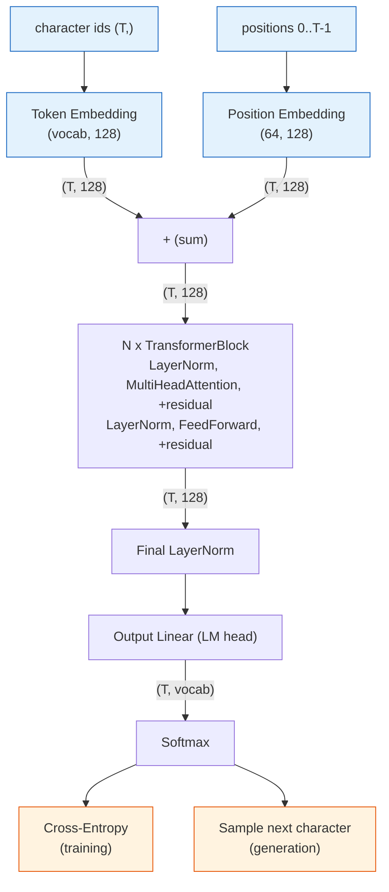
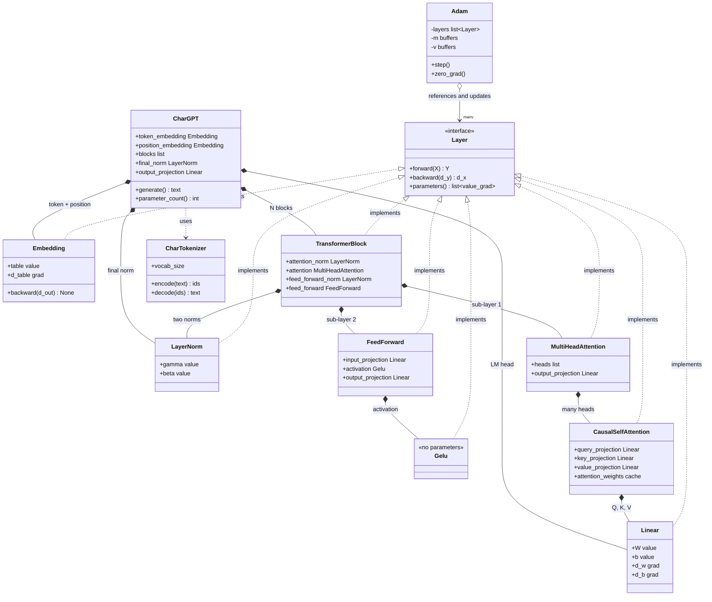
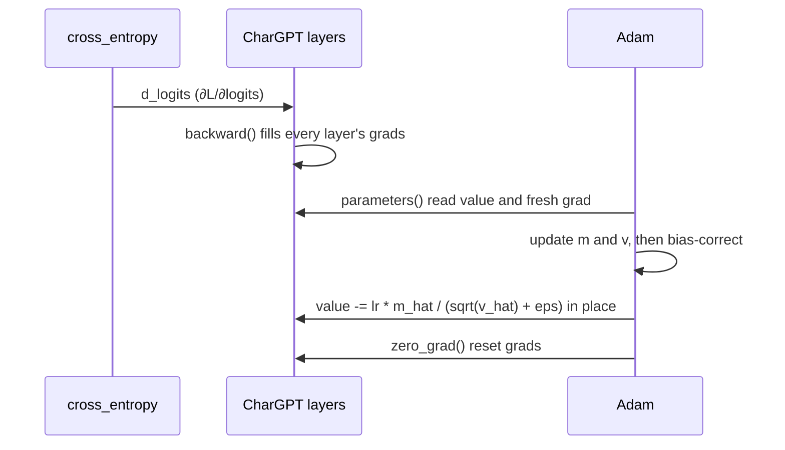

# Implementation — character-level GPT from scratch in NumPy

The build spec. Theory for each component is in [LEARNING.md](LEARNING.md); components to
re-implement solo later are tracked in [BACKLOG.md](BACKLOG.md).

> **Golden rule:** nothing with a backward pass is done until a **finite-difference gradient
> check passes**.

---

## Task

Build a **decoder-only Transformer (GPT) that generates text one character at a time**, entirely
from scratch in NumPy — Track 3 of the assignment.

- **Dataset:** Tiny Shakespeare, ~1.1 M characters of play text, 90/10 train/validation split.
- **Model:** 620,740 parameters — `d_model=128`, 4 heads, 3 blocks, 64-character context.
- **Deliverable:** a Jupyter notebook that runs start→finish + a ~6-page report.
- **Constraint:** the network is from scratch; only NumPy for the model. Matplotlib for plots,
  tokenizer self-written, Python stdlib for data loading.

**Scope note.** This branch is deliberately limited to the text GPT, which is a complete Track-3
project on its own. The multimodal image-captioning extension (patch embeddings, split mask,
Flickr8k, grounding analysis) lives on `main` and is not part of this deliverable.

---

## Architecture overview

The forward data-flow. It is shared by both modes and differs only at the very end: **training**
feeds predictions into cross-entropy; **generation** samples the next character and loops.

Shapes use `d_model=128`, context `T ≤ 64`, vocabulary 68.



## Components & connections

| Component | Responsibility | In → Out | Connects |
|---|---|---|---|
| **CharTokenizer** | text ↔ integer ids; owns the vocabulary and `<bos>`/`<eos>`/`<pad>` | text → `(T,)` | → Token Embedding |
| **Token Embedding** | lookup table: id → learned vector | `(T,)` → `(T,128)` | → sum |
| **Position Embedding** | lookup table: *position* → learned vector; supplies word order | `(T,)` → `(T,128)` | → sum |
| **Sum** | "what" + "where" in one representation per position | → `(T,128)` | → blocks |
| **LayerNorm** | normalize each token across features; stabilizes depth | `(T,128)` → `(T,128)` | ×2 per block + final |
| **MultiHeadAttention** | mix information **across** positions, causally | `(T,128)` → `(T,128)` | sub-layer 1 of each block |
| **FeedForward** | transform **each** token independently (×4 width) | `(T,128)` → `(T,128)` | sub-layer 2 of each block |
| **Residual** | add sub-layer output back; keeps gradients flowing | same shape | wraps both sub-layers |
| **TransformerBlock ×N** | one round of "attend, then think" | `(T,128)` → `(T,128)` | chained N times |
| **Final LayerNorm** | normalize before the output projection | `(T,128)` → `(T,128)` | → LM head |
| **Output Linear** (LM head) | project each token to vocabulary logits | `(T,128)` → `(T,vocab)` | → Softmax |
| **cross_entropy** *(train)* | error vs. the true next character | → scalar loss | seeds backprop |
| **generate** *(inference)* | sample, append, repeat until `<eos>`/cap | → text | the demo |

**Key connections**
- **Token + position are summed**, so backward sends the *same* gradient to both tables.
- **The positional table's size *is* the context window**, so `generate()` crops its input to the
  last `max_sequence_length` characters.
- **The mask is causal**: position `i` attends only to `≤ i`. That is what makes training on all
  `T` positions at once legitimate.
- **One block = attend, then process** — attention shares information *between* tokens, the MLP
  transforms *each* token; residual + LayerNorm keep the stack trainable.

## Input / Output

- **Training input:** one window of `block_size + 1` ids → `inputs = window[:-1]`,
  `targets = window[1:]` (teacher forcing).
- **Training output:** scalar cross-entropy → gradients into every layer.
- **Inference input:** an optional prompt string (may be empty).
- **Inference output:** generated text, one character at a time until `<eos>` or the cap.

**Runtime (generation) flow**
```
start: [<bos>] (+ prompt ids)
loop until <eos> / max_new_tokens:
   crop to the last max_sequence_length ids
   forward pass -> take probabilities at the LAST position
   sample (temperature) -> append
```

| Iter | Model input | Predicts |
|---|---|---|
| 1 | `<bos> R O M E O :` | `\n` |
| 2 | `<bos> R O M E O : \n` | `W` |
| 3 | `… W` | `h` |

---

## Software design (components & responsibilities)

Four kinds of component: **layers compute**, the **loss** scores and seeds backprop, the
**optimizer** updates, the **tokenizer** converts text ↔ ids. Every layer shares one interface,
so the optimizer treats them all identically.

### Layer (interface)
```
Layer   (Linear, Embedding, LayerNorm, Gelu, attention, FeedForward, TransformerBlock)
    - holds params (values) + grads (filled by backward)
    - forward(), backward()
    - parameters() -> [(value, grad), ...]   # uniform interface for the optimizer
    - zero_grad()
```

### Linear — `Y = X @ W + b`
```
    - params: W (n_in, n_out), b (n_out)   ; grads: d_w, d_b
    - init  : W ~ N(0,1) / sqrt(n_in)  (Xavier-style), b = 0
    - forward(X)    -> X @ W + b           ; caches X
    - backward(d_y) -> d_x                 ; d_w = X.T @ d_y, d_b = sum(d_y)
```
**The `1/sqrt(n_in)` scaling is load-bearing.** Each output sums `n_in` products, so unscaled
standard-normal weights grow activations by ~`sqrt(n_in)` per layer. With plain `standard_normal`
the GPT started at loss ≈14.8 instead of `ln(vocab)` ≈3.4 and stalled around 2.5 emitting
gibberish; with the scaling it trains normally. **Every gradient check still passed while it was
broken** — the gradients were right, the *scale* was wrong.

### Embedding — id → learned vector
```
    - param: table (vocab_size, d)   the ONE parameter (no bias) ; grad: d_table
    - init : table ~ N(0, 0.02)      small, as GPT does
    - forward(ids)    -> table[ids]  row lookup ; caches ids
    - backward(d_out) -> None        scatter-add into d_table (np.add.at)
```
Two differences from Linear: backward is a **scatter-add** (a repeated id accumulates gradient
from every occurrence — plain assignment would overwrite), and it returns **no input gradient**,
since integer ids are not differentiable and it is always the first layer. Used twice: once for
tokens, once for positions.

### CausalSelfAttention — mixing information across positions
```
    - params: three Linear projections (query, key, value) -> Q, K, V
    - forward(X)      -> softmax(Q @ K.T / sqrt(d_head) + causal_mask) @ V
                         X (T, d_model) -> (T, d_head) ; caches Q, K, V, weights
    - backward(d_out) -> d_x  (T, d_model)
```
The hardest chain in the project — four links: the weighted sum `weights @ V`, the row-wise
**softmax Jacobian** `∂L/∂s = p * (∂L/∂p − Σ(∂L/∂p·p))`, the `1/√d_head` scaling, then `Q Kᵀ`.
Because X feeds all three projections, `d_x` is the **sum** of the three paths. Masked entries
have `p = 0`, so no gradient leaks to the future.

### MultiHeadAttention — several attention patterns at once
```
    - h heads (each d_head = d_model / h) + output_projection Linear(d_model, d_model)
    - forward(X)      -> concat(head outputs) -> output_projection
    - backward(d_out) -> split the gradient per head, SUM their d_x
```
Rejects a `d_model` not divisible by `number_of_heads` rather than misbehaving quietly.

### LayerNorm — keeping activations at a stable scale
```
    - params: gamma (d_model,) scale [init 1], beta (d_model,) shift [init 0]
    - forward(X)    -> gamma * (X - mean) / sqrt(var + eps) + beta
                       mean/var over the LAST axis (one token), not the batch
    - backward(d_y) -> d_x
```
Second-hardest derivation: `mu` and `sigma` depend on **every** feature of a token, so one
feature moves all of that token's outputs. Hence three terms —
`d_x = (d_norm − mean(d_norm) − x_hat·mean(d_norm·x_hat)) / sigma`. `d_gamma`/`d_beta` sum over
every axis except the feature axis, since both are shared across tokens.

### Gelu — smooth activation (a Layer with no parameters)
```
    - gelu(x) = 0.5 * x * (1 + tanh( sqrt(2/pi) * (x + 0.044715 x^3) ))
    - parameters() -> []   (shaped as a Layer so blocks can chain it)
```

### FeedForward — the MLP sub-layer
```
    - Linear(d_model -> 4*d_model) -> Gelu -> Linear(4*d_model -> d_model)
```
Attention mixes information **between** tokens; this transforms **each token independently**.
The ×4 expansion is where most of the parameters live.

### TransformerBlock — one pre-norm decoder block
```
    h = X + attention(LayerNorm_1(X))
    Y = h + feed_forward(LayerNorm_2(h))
    - owns 2 x LayerNorm, 1 x MultiHeadAttention, 1 x FeedForward (no params of its own)
```
**Residual backward rule:** the gradient arriving at an addition flows to **both** branches
unchanged, so each residual contributes `d_out` (skip path) + the branch gradient. Pre-norm
(normalizing *inside* the residual branch) keeps the residual stream un-normalized end to end,
which trains far more stably at depth than post-norm.

### CharGPT — the assembled model
```
    - forward(token_ids (T,))    -> logits (T, vocab_size)
    - backward(d_logits)         -> None (gradients land in the layers)
    - parameters() / zero_grad() -> everything, so one Adam updates the whole model
    - parameter_count()          -> trainable scalars
    - generate(tokenizer, ...)   -> text; CROPS context to max_sequence_length
```

### cross_entropy — the loss (a function, NOT a Layer)
```
    - cross_entropy(scores, targets) -> (mean_loss, gradient_wrt_scores)
    - no parameters ; gradient_wrt_scores = (softmax - onehot) / batch
```

### Adam — the optimizer
```
    - references the layers ; per-param state m, v ; shared state t, lr, β1, β2, ε
    - step():      loop all params -> update in place, reading grads FRESH each step
    - zero_grad(): reset every layer's grads
```

### CharTokenizer — text ↔ ids (utility, NOT a Layer)
```
    - id_to_token / token_to_id : vocabulary incl. <pad>, <bos>, <eos>
    - encode(text) -> [ids]  (optionally wrapped in <bos>/<eos>)
    - decode([ids]) -> text  (optionally skipping special tokens)
    - vocab_size
```

### Helpers
```
    numeric_gradient(f, x)  central finite differences -- the verifier for every backward
    stable_softmax(x)       whole-array softmax (log-sum-exp trick)
    softmax_rows(scores)    ROW-wise softmax for attention; tolerates -inf (masked) entries
```

**Class relationship (training-time view).** `Adam` and `cross_entropy` exist only while
training; at generation time only `CharTokenizer` + the trained `CharGPT` run.



**One training step**


**Two correctness rules**
- **Update in place** — `value -= …`, never `value = value − …`, or the layer's `W` never changes.
- **Read grads fresh each step** — `backward()` rebinds grads to new arrays, so `step()` must
  call `parameters()` every time; values are safe to hold, grads are not.

---

## Build order & verification

Built bottom-up; each row reuses the ones above.

| ✓ | Component | Verified by |
|---|---|---|
| ✅ | `numeric_gradient`, `stable_softmax` | grad of `x²` is `2x`; softmax safe for `x + 1000` |
| ✅ | `Linear` | grad checks on `d_w / d_b / d_x` |
| ✅ | `cross_entropy`, `Adam` | loss falls, weights change in place, fits a learnable task |
| ✅ | `CharTokenizer` | round-trips; `<bos>`/`<eos>` wrapping; one id per character |
| ✅ | `Embedding` | grad check; **scatter-add accumulates** on a repeated id; returns `None` |
| ✅ | `CausalSelfAttention` ⭐ | grad checks on `W_q/W_k/W_v/X`; upper triangle exactly 0; a future token cannot change earlier outputs |
| ✅ | `MultiHeadAttention` | grad checks incl. the **last** head (proves the per-head split lines up); stays causal; rejects indivisible `d_model` |
| ✅ | `LayerNorm` | grad checks incl. the three-term `d_x`; rows zero-mean/unit-variance; invariant to per-token shift and scale |
| ✅ | `Gelu`, `FeedForward` | `∂Gelu/∂X` matches numeric; ×4 hidden width; per-token (row 0 unaffected by row 1) |
| ✅ | `TransformerBlock` | grad check through both residuals; stays causal; **zeroed branches → identity** (residual proven) |
| ✅ | `CharGPT` | grad check incl. **both** embedding tables; rejects over-long sequences; same token differs by position |
| ✅ | Training on Tiny Shakespeare | starts near `ln(vocab)`; val loss well below baseline; readable words |

---

## Results

All figures below are produced by the notebook (93/93 checks pass, 0 errors).

**CharGPT on Tiny Shakespeare** — 10 % held-out validation tail, uniform baseline
`ln(68)` = 4.220 nats/char (perplexity 68):

| Metric | Value |
|---|---|
| Parameters | 620,740 |
| Train loss | 3.435 → 1.718 |
| **Validation loss** | 2.504 → **1.810** nats/char |
| **Validation perplexity** | **6.11** — 11.1× better than random guessing |
| Train/val gap | 0.125 nats → generalizing, not memorizing |

~6.1 perplexity means the model is effectively choosing among ~6 characters instead of 68.
Qualitatively the samples carry real English words, play formatting (speaker lines, line breaks)
and plausible punctuation, while sentences stay semantically loose — the expected outcome at this
size, which the assignment explicitly anticipates for Track 3.

**Hyperparameter finding.** The learning rate dominates, for a reason specific to this
implementation: with **one window per step** the gradient estimate is noisy, so `lr=5e-3` was the
worst setting tested and plateaued near 2.5, while `lr=5e-4` reached 1.81 on the same budget.
Multiple heads clearly beat a single head at equal parameter count, and halving `d_model` loses
ground.

⚠️ **The 2000-step sweep ranks early learning speed, not final quality.** The 1-block model looks
best there (2.340 vs the 3-block baseline's 2.384) purely because smaller models converge faster
early; over the full budget the 3-block model reaches 1.81. A short sweep is a cheap way to rule
out clearly bad settings, not a way to pick the best architecture.

**Known limitation — no batching.** Every layer takes a **single sequence** `(T, d_model)`, which
kept the attention and LayerNorm backward passes directly gradient-checkable. The cost is
sample efficiency: one window per step instead of a batch. Adding a leading batch axis is the
obvious next optimization; it is not required for this deliverable.

---

## Deliverables

| Artifact | What it is |
|---|---|
| **`notebooks/Implementation.ipynb`** | the deliverable — all code + markdown, runs start→finish |
| **`notebooks/Theory.ipynb`** | the theory write-ups behind each component |
| **`notebooks/data/tinyshakespeare.txt`** | the corpus (auto-downloaded if absent) |
| **`report.pdf`** | ~6-page GPT report *(to write)* |

Core demo:
```python
model.generate(tokenizer, max_new_tokens=400, temperature=0.8, prompt="ROMEO:")
```
