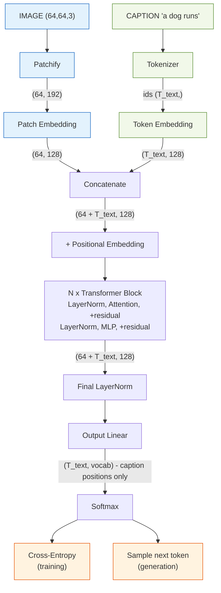
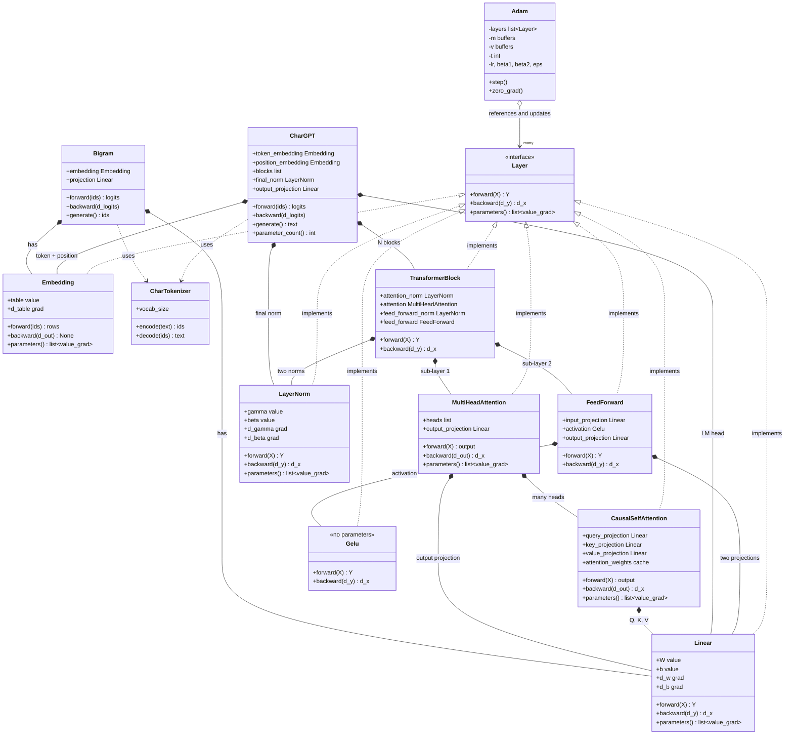
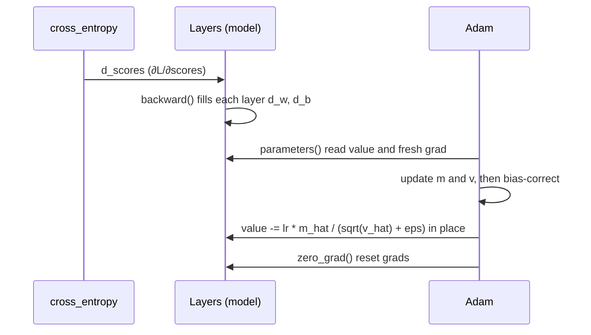

# Implementation Plan — Image Captioning Transformer from Scratch

The **build spec**. For the theory behind each step, see [LEARNING.md](LEARNING.md)
(same step numbers).

> **Golden rule:** anything with a backward pass isn't done until a **finite-difference
> gradient check passes** (built in Step 0).

---

## Task

Build a **decoder-only Transformer that generates a text caption for an image**, entirely
from scratch in NumPy (Track 3). Given a new image, the model outputs a sentence describing
it, one token at a time. Captioning = next-token language modeling conditioned on an image.

- **Dataset:** Flickr8k (real photos + human captions), downscaled, ~1–2k-image subset.
- **Deliverable:** a Jupyter notebook that runs start→finish + a ~6-page report.
- **Constraint:** network from scratch; only NumPy for the model (sklearn/Matplotlib for
  prep/plots, tokenizer may be self-written).

---

## Architecture choice — decoder-only with an image prefix

The classic captioning design is **encoder-decoder**: an image encoder produces K/V, a text
decoder reads them via **cross-attention**. We chose the other valid design:

```
Encoder-decoder :  image → encoder → K,V → text decoder w/ CROSS-attention → caption
Ours            :  [image tokens | caption tokens] → ONE decoder stack → caption
```

**Why:** self-attention over the concatenated sequence already does the cross-modal mixing —
a caption token attending over the prefix *is* attending to the image. So we implement **one**
attention class instead of two (no separate cross-attention to hand-backprop), it matches how
modern multimodal LLMs condition on images, and it stays exactly Track 3 (decoder-only,
next-token prediction).

**Consequence — a split mask:** image tokens are **unmasked** (context), caption tokens are
**causal**. So `CausalSelfAttention` (currently fully causal for the char-GPT) needs an
**optional mask argument** at the vision-bridge step.

---

## Architecture overview

This is the **actual working process** — the forward data-flow the model runs to turn an
image + caption tokens into next-token predictions. It's shared by both modes and only
differs at the very end: **training** feeds the predictions into cross-entropy; **generation**
samples the next token and loops. (The optimizer/learning view is the class diagram below.)

Shapes use `d_model=128`, 64×64 image, 8×8 patches → 64 image tokens.



## Components & connections

| Component | Responsibility | In → Out | Connects |
|---|---|---|---|
| **Image preprocess** *(offline)* | decode + resize to fixed size, save as array | JPEG → `(64,64,3)` | feeds Patchify |
| **Patchify** | cut image into non-overlapping patches, flatten each | `(64,64,3)` → `(64, 192)` | → Patch Embedding |
| **Patch Embedding** | Linear projecting each patch to model width → "image tokens" | `(64, 192)` → `(64, 128)` | → Concatenate |
| **Tokenizer** | caption text ↔ integer ids; adds `<bos>`/`<eos>` | text → `(T_text,)` | → Token Embedding |
| **Token Embedding** | lookup table: id → learned vector | `(T_text,)` → `(T_text,128)` | → Concatenate |
| **Concatenate** | build one sequence: image tokens then caption tokens | → `(64+T_text, 128)` | → Positional |
| **Positional Embedding** | add position info (attention is order-blind without it) | same shape | → Blocks |
| **LayerNorm** | normalize features per token; stabilizes training | `(T,128)` → `(T,128)` | inside each block (×2) + final |
| **Multi-Head Attention** | mix info across positions; **image unmasked, caption causal** | `(T,128)` → `(T,128)` | core of each block |
| **Residual** | add sublayer input back to output; keeps gradients flowing | same shape | wraps attention + MLP |
| **MLP** (Linear→GELU→Linear) | per-token nonlinear transform (×4 width expand) | `(T,128)` → `(T,128)` | second sublayer of block |
| **Transformer Block ×N** | one round of "attend, then think"; stacked for depth | `(T,128)` → `(T,128)` | chained N times |
| **Final LayerNorm** | normalize before the output projection | `(T,128)` → `(T,128)` | → Output Linear |
| **Output Linear** (LM head) | project each token to vocabulary-sized logits | `(T,128)` → `(T,vocab)` | → Softmax |
| **Softmax** | logits → probability distribution over next token | `(T,vocab)` | → loss / sampling |
| **Cross-Entropy** *(train)* | error vs. true next token, **caption positions only** | → scalar loss | drives backprop |
| **Generation** *(inference)* | sample next token, append, repeat until `<eos>` | → caption text | the demo |

**Key connections:**
- **Two modalities, one sequence** — patch and token embeddings both output `d_model`
  vectors, so attention mixes image + text in the same space.
- **Split mask** — image tokens see everything; caption tokens are causal.
- **Loss ignores image positions** — only caption tokens have a "correct next token."
- **One block = attend, then process** — attention shares info between tokens; MLP transforms
  each token; residual + LayerNorm keep the stack trainable.

## Input / Output

- **Training input:** `(image (64,64,3), caption ids (T_text,))` pairs.
- **Training output:** scalar cross-entropy loss on caption positions → gradients.
- **Inference input:** one image `(64,64,3)`.
- **Inference output:** a caption string, generated token by token until `<eos>`.

**Runtime (inference) flow** — image encoded once, caption built autoregressively:
```
encode image ONCE → 64 image tokens
start: [image tokens | <bos>]
loop until <eos>/max-len:
   forward pass → take probs at LAST position → pick token → append
```
| Iter | Model input | Predicts | Caption |
|---|---|---|---|
| 1 | `[img] <bos>` | `a` | a |
| 2 | `[img] <bos> a` | `dog` | a dog |
| 3 | `[img] <bos> a dog` | `runs` | a dog runs |
| 4 | `[img] <bos> a dog runs` | `<eos>` | **done** |

## Software design (components & responsibilities)

Four kinds of component, each with one responsibility:
**layers compute**, the **loss** scores + seeds backprop, the **optimizer** updates,
the **tokenizer** converts text ↔ ids. Layers share one interface so the optimizer treats
them all the same.

### Layer (interface)
```
Layer   (Linear, Embedding, Attention, ...)   →  COMPUTE
    - holds params (values) + grads (filled by backward)
    - forward(), backward()
    - parameters() -> [(value, grad), ...]   # uniform interface for the optimizer
    - zero_grad()
```

### Linear  — fully-connected layer  `Y = X @ W + b`
```
    - params: W (n_in, n_out), b (n_out)   ; grads: d_w, d_b
    - init  : W ~ N(0,1) / sqrt(n_in)  (Xavier-style), b = 0
    - forward(X)   -> X @ W + b            ; caches X
    - backward(d_y) -> d_x                   ; fills d_w = X.T @ d_y, d_b = sum(d_y)
    - parameters() -> [(W, d_w), (b, d_b)]
```
**The `1/sqrt(n_in)` scaling is load-bearing, not cosmetic.** Each output sums `n_in` products,
so unscaled standard-normal weights grow activations by ~`sqrt(n_in)` per layer. With plain
`standard_normal`, CharGPT started at loss ≈14.8 instead of `ln(vocab)` ≈3.4 and stalled around
2.5 emitting gibberish; with the scaling it reaches ≈0.13 and produces readable text — same
architecture, same step count. Note that **every gradient check still passed** in the broken
case: the gradients were right, the *scale* was wrong.

### Embedding  — token id → learned vector
```
    - param: table (vocab_size, d)          the ONE parameter (no bias) ; grad: d_table
    - init : table ~ N(0, 0.02)             small, as GPT does
    - forward(ids)   -> table[ids]         row lookup ; caches ids
    - backward(d_out) -> None               scatter-add into d_table (np.add.at)
    - parameters()   -> [(table, d_table)]
```
Differs from Linear in two ways: backward is **scatter-add** (duplicate ids accumulate),
and it returns **no input gradient** (`None`) — integer ids aren't differentiable and it's
always the first layer. Same `parameters()` contract, so the optimizer needs no special case.

### CausalSelfAttention  — mixing information across positions
```
    - params: three Linear projections (query, key, value)  -> Q, K, V
    - forward(X)    -> softmax(Q @ K.T / sqrt(d_head) + causal_mask) @ V
                       X (T, d_model) -> output (T, d_head) ; caches Q, K, V, weights
    - backward(d_out) -> d_x   (T, d_model)
    - parameters()  -> q + k + v projection params
```
Backward is the hardest chain in the project — four links: the weighted sum `weights @ V`,
the row-wise **softmax Jacobian** `∂L/∂s = p * (∂L/∂p − Σ(∂L/∂p·p))`, the `1/√d_head` scaling,
then `Q Kᵀ`. Because X feeds all three projections, `d_x` is the **sum** of the three paths.
Masked entries have `p = 0`, so no gradient leaks to the future.

### MultiHeadAttention  — several attention patterns at once
```
    - h heads (each d_head = d_model / h) + one output_projection Linear(d_model, d_model)
    - forward(X)      -> concat(head outputs) -> output_projection   (T, d_model)
    - backward(d_out) -> split the gradient per head, SUM their d_x
    - parameters()    -> all heads' params + output_projection's
```
Rejects a `d_model` not divisible by `number_of_heads` rather than misbehaving quietly.

### LayerNorm  — keeping activations at a stable scale
```
    - params: gamma (d_model,) scale [init 1], beta (d_model,) shift [init 0]
              grads: d_gamma, d_beta
    - forward(X)   -> gamma * (X - mean) / sqrt(var + eps) + beta
                      mean/var over the LAST axis (one token), not over the batch
                      caches normalized_input (x_hat) and standard_deviation
    - backward(d_y) -> d_x   (..., d_model)
    - parameters() -> [(gamma, d_gamma), (beta, d_beta)]
```
Backward is the second-hardest derivation after attention: `mu` and `sigma` depend on **every**
feature of a token, so one feature moves all of that token's outputs. Hence three terms — the
direct path, a mean correction, and a variance correction:
`d_x = (d_norm − mean(d_norm) − x_hat·mean(d_norm·x_hat)) / sigma`.
`d_gamma`/`d_beta` sum over every axis except the feature axis, since both are shared across
all tokens.

### Gelu  — smooth activation (a Layer with no parameters)
```
    - gelu(x) = 0.5 * x * (1 + tanh( sqrt(2/pi) * (x + 0.044715 x^3) ))
    - forward(X)   -> elementwise gelu ; caches X
    - backward(d_y) -> d_y * gelu'(x)
    - parameters() -> []          (nothing to train; shaped as a Layer so blocks can chain it)
```
A smooth ReLU: no hard zero-gradient region, so units cannot "die".

### FeedForward  — the MLP sub-layer (per-token processing)
```
    - Linear(d_model -> 4*d_model) -> Gelu -> Linear(4*d_model -> d_model)
    - forward(X)   -> Y      (T, d_model) -> (T, d_model)
    - backward(d_y) -> d_x   chain back through output proj, Gelu, input proj
    - parameters() -> both projections' params
```
Attention mixes information **between** tokens; this transforms **each token independently** —
the block's division of labour is "attend, then think". The ×4 expansion is where most of a
Transformer's parameters live.

### TransformerBlock  — one pre-norm decoder block
```
    h = X + attention(LayerNorm_1(X))
    Y = h + feed_forward(LayerNorm_2(h))

    - owns: 2 x LayerNorm, 1 x MultiHeadAttention, 1 x FeedForward (no params of its own)
    - forward(X)   -> Y      (T, d_model) -> (T, d_model)
    - backward(d_y) -> d_x
    - parameters() -> all four sub-components' params
```
**Residual backward rule:** the gradient arriving at an addition flows to **both** branches
unchanged, so each residual contributes `d_out` (skip path) + the branch gradient. Pre-norm
(normalize *inside* the residual branch) keeps the residual stream un-normalized end to end,
which trains far more stably at depth than post-norm.

### CharGPT  — the assembled decoder-only Transformer
```
    ids -> token_embedding ------+
                                 + -> N x TransformerBlock -> LayerNorm -> Linear -> logits
    positions -> position_embedding -+

    - forward(token_ids (T,))      -> logits (T, vocab_size)
    - backward(d_logits)            -> None (gradients land in the layers)
    - parameters() / zero_grad()    -> everything, so one Adam updates the whole model
    - parameter_count()             -> trainable scalars (for the report's model-size section)
    - generate(tokenizer, ...)      -> autoregressive text; CROPS context to max_sequence_length
```
- **Positional embeddings** are just a second `Embedding` indexed by **position** instead of
  token id. Because the two are **added**, backward sends the *same* gradient to both tables.
- The positional table's size **is** the context window, so `generate()` must crop its input to
  the last `max_sequence_length` tokens.

### softmax_rows  — row-wise stable softmax (helper, not a Layer)
```
    - one distribution per query ROW (max/sum along the last axis only)
    - tolerates -inf entries (masked positions get exactly zero probability)
    - distinct from stable_softmax, which normalises over the whole array
```

### cross_entropy  — the loss (a function, NOT a Layer)
```
    - cross_entropy(scores, targets) -> (mean_loss, gradient_wrt_scores)
    - no parameters ; seeds backprop with gradient_wrt_scores = (softmax - onehot) / batch
```

### Adam  — the optimizer
```
    - references the layers            self.layers
    - per-param state: m, v (buffers, zeros, same shapes)
    - shared state:    t, lr, β1, β2, ε
    - step():  loop all params -> Adam update in place (reads grads fresh each step)
    - zero_grad(): reset every layer's grads
```

### CharTokenizer  — text ↔ ids (utility, NOT a Layer)
```
    - id_to_token / token_to_id : the vocabulary (incl. <pad>, <bos>, <eos>)
    - encode(text) -> [ids]   (optionally wraps with <bos>/<eos>)
    - decode([ids]) -> text   (optionally skips special tokens)
    - vocab_size
```

### Models — assembled from the components above
```
Bigram   : Embedding(vocab, d) -> Linear(d, vocab) -> cross_entropy -> Adam
           predicts next token from ONLY the current token
           trained on shift-by-one pairs: inputs = ids[:-1], targets = ids[1:]
           generate(): <bos> -> embed -> Linear -> softmax -> sample -> until <eos>

CharGPT  : (token_embedding + position_embedding) -> N x TransformerBlock
           -> LayerNorm -> Linear -> cross_entropy -> Adam
           attends over the whole context window, not just the previous token
           trained on random windows of block_size (teacher forcing)
           generate(): crops to max_sequence_length, samples until <eos>/cap

Captioner: (PatchEmbedding + token_embedding + position_embedding) -> N x TransformerBlock
           -> LayerNorm -> Linear -> cross_entropy   [split mask: image free, caption causal]
           the same skeleton as CharGPT with image tokens prepended
```

**Measured result — why the whole stack is worth it.** Same corpus, same tokenizer:

| Model | Context seen | Final loss | Sample quality |
|---|---|---|---|
| `Bigram` | 1 character | 1.287 | letter-soup: `tr theps azy the og therownd` |
| `CharGPT` (106k params) | 32 characters | **0.132** | correct words and sentences |

(uniform baseline `ln(vocab)` = 3.434)

**Class relationship (training-time view):**

This shows the **learning process** — `Adam` (and `cross_entropy`) exist only while training.
At **generation time** they drop out: only `CharTokenizer` + the trained model (`Bigram` →
`Embedding` + `Linear`) run, via `generate()`.



**One training step (how they interact):**


**Two correctness rules:**
- **Update in place** — `value -= …` (not `value = value − …`), else the layer's `W` never changes.
- **Read grads fresh each step** — `backward()` rebinds `d_w`/`d_b` to new arrays, so `step()`
  must call `parameters()` each time; values are safe to hold, grads are not.

---

## Deliverables (the executable)

| Artifact | What it is |
|---|---|
| **`captioning.ipynb`** | the deliverable — all code + markdown, runs start→finish |
| **`model.py`** *(optional)* | from-scratch modules, imported by the notebook |
| **`weights.npy`** | trained parameters, so the demo runs without retraining |
| **`report.pdf`** | ~6-page GPT report |

Core demo cell: `caption = generate(model, image); print(caption)` + attention overlay.

---

## Build order & verification

Build bottom-up; each row reuses the ones above. Nothing with a backward pass is done until
its **gradient check passes**. (Theory for each is in [LEARNING.md](LEARNING.md).)

| ✓ | Build | Verify (done when) |
|---|---|---|
| ✅ | `numeric_gradient`, `stable_softmax` | grad of `x²` is `2x`; softmax safe for `x + 1000` |
| ✅ | `Linear` | grad checks on `d_w/d_b/d_x` pass |
| ✅ | `cross_entropy`, `Adam` | loss falls, weights change in place, fits a learnable task; grad check passes |
| ✅ | `CharTokenizer`, `Embedding`, `Bigram` + `generate` | tokenizer round-trips; embedding grad check (scatter-add accumulates); loss `< ln(vocab)`; forms letter patterns |
| ✅ | `CausalSelfAttention`, `MultiHeadAttention` ⭐ | grad checks pass; changing a future token doesn't change earlier outputs; upper triangle exactly 0 |
| ✅ | `LayerNorm` | grad checks incl. the three-term `d_x`; rows zero-mean/unit-variance; invariant to per-token shift and scale |
| ✅ | `Gelu`, `FeedForward` | `∂Gelu/∂X` matches numeric; ×4 hidden width; per-token (row 0 unaffected by row 1) |
| ✅ | `TransformerBlock` | grad check through both residuals; stays causal; **zeroed branches → identity** (residual proven) |
| ✅ | `CharGPT` (positional + N blocks + LM head) | grad check incl. **both** embedding tables; rejects over-long sequences; same token differs by position |
| ✅ | Train char-GPT | starts near `ln(vocab)`; beats baseline **and** the bigram on the same corpus (0.132 vs 1.287); readable words — ✅ **valid Track-3 project reached** |
| ⬜ | Optional mask arg on attention | image positions unmasked, caption positions causal, in one sequence |
| ⬜ | `patchify`, `PatchEmbedding`, joint sequence | shapes correct; end-to-end grad check |
| ⬜ | Flickr8k pipeline (offline resize → `.npy`) | images load as arrays; captions paired and tokenized |
| ⬜ | Train captioner + `generate(image)` | clean train/val curves; captions relate to held-out images |
| ⬜ | Diagnostics + grounding analysis | overfit 2 examples → ~0 loss; some words ground to sensible regions |

**Safety net:** the char-GPT row is reached — there is already a submittable Track-3 text GPT.
Everything below it is the multimodal upgrade on top.

**Open design decision — batching.** All layers currently take a **single sequence** `(T, d_model)`,
which kept the attention and LayerNorm backward passes directly gradient-checkable. Measured
cost: 1500 steps at `T=32, d_model=64` ≈ 5 s, whole notebook ≈ 15 s. The captioner will run at
`T ≈ 64 image + ~40 text` over ~1–2k samples, so single-sequence stays viable on a small subset;
add a leading batch axis only if training time actually becomes the blocker.
