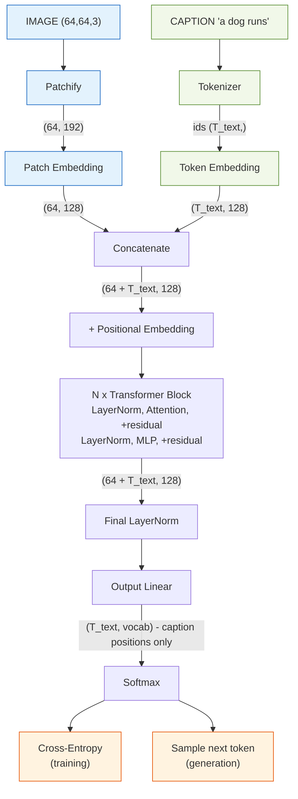
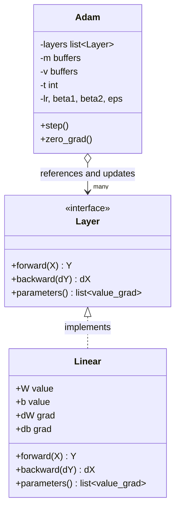
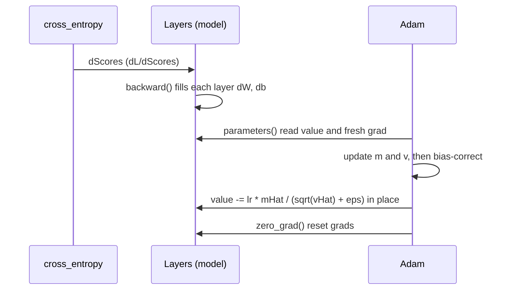

# Implementation Plan — Image Captioning Transformer from Scratch

The **build spec**. For the theory behind each step, see [LEARNING.md](LEARNING.md)
(same step numbers).

> **Golden rule:** anything with a backward pass isn't done until a **finite-difference
> gradient check passes** (built in Step 0).

---

## Task

Build a **decoder-only Transformer that generates a text caption for an image**, entirely
from scratch in NumPy (Track 3). Given a new image, the model outputs a sentence describing
it, one token at a time. Captioning = next-token language modeling conditioned on an image.

- **Dataset:** Flickr8k (real photos + human captions), downscaled, ~1–2k-image subset.
- **Deliverable:** a Jupyter notebook that runs start→finish + a ~6-page report.
- **Constraint:** network from scratch; only NumPy for the model (sklearn/Matplotlib for
  prep/plots, tokenizer may be self-written).

---

## Architecture overview

Shapes use `d_model=128`, 64×64 image, 8×8 patches → 64 image tokens.



## Components & connections

| Component | Responsibility | In → Out | Connects |
|---|---|---|---|
| **Image preprocess** *(offline)* | decode + resize to fixed size, save as array | JPEG → `(64,64,3)` | feeds Patchify |
| **Patchify** | cut image into non-overlapping patches, flatten each | `(64,64,3)` → `(64, 192)` | → Patch Embedding |
| **Patch Embedding** | Linear projecting each patch to model width → "image tokens" | `(64, 192)` → `(64, 128)` | → Concatenate |
| **Tokenizer** | caption text ↔ integer ids; adds `<bos>`/`<eos>` | text → `(T_text,)` | → Token Embedding |
| **Token Embedding** | lookup table: id → learned vector | `(T_text,)` → `(T_text,128)` | → Concatenate |
| **Concatenate** | build one sequence: image tokens then caption tokens | → `(64+T_text, 128)` | → Positional |
| **Positional Embedding** | add position info (attention is order-blind without it) | same shape | → Blocks |
| **LayerNorm** | normalize features per token; stabilizes training | `(T,128)` → `(T,128)` | inside each block (×2) + final |
| **Multi-Head Attention** | mix info across positions; **image unmasked, caption causal** | `(T,128)` → `(T,128)` | core of each block |
| **Residual** | add sublayer input back to output; keeps gradients flowing | same shape | wraps attention + MLP |
| **MLP** (Linear→GELU→Linear) | per-token nonlinear transform (×4 width expand) | `(T,128)` → `(T,128)` | second sublayer of block |
| **Transformer Block ×N** | one round of "attend, then think"; stacked for depth | `(T,128)` → `(T,128)` | chained N times |
| **Final LayerNorm** | normalize before the output projection | `(T,128)` → `(T,128)` | → Output Linear |
| **Output Linear** (LM head) | project each token to vocabulary-sized logits | `(T,128)` → `(T,vocab)` | → Softmax |
| **Softmax** | logits → probability distribution over next token | `(T,vocab)` | → loss / sampling |
| **Cross-Entropy** *(train)* | error vs. true next token, **caption positions only** | → scalar loss | drives backprop |
| **Generation** *(inference)* | sample next token, append, repeat until `<eos>` | → caption text | the demo |

**Key connections:**
- **Two modalities, one sequence** — patch and token embeddings both output `d_model`
  vectors, so attention mixes image + text in the same space.
- **Split mask** — image tokens see everything; caption tokens are causal.
- **Loss ignores image positions** — only caption tokens have a "correct next token."
- **One block = attend, then process** — attention shares info between tokens; MLP transforms
  each token; residual + LayerNorm keep the stack trainable.

## Input / Output

- **Training input:** `(image (64,64,3), caption ids (T_text,))` pairs.
- **Training output:** scalar cross-entropy loss on caption positions → gradients.
- **Inference input:** one image `(64,64,3)`.
- **Inference output:** a caption string, generated token by token until `<eos>`.

**Runtime (inference) flow** — image encoded once, caption built autoregressively:
```
encode image ONCE → 64 image tokens
start: [image tokens | <bos>]
loop until <eos>/max-len:
   forward pass → take probs at LAST position → pick token → append
```
| Iter | Model input | Predicts | Caption |
|---|---|---|---|
| 1 | `[img] <bos>` | `a` | a |
| 2 | `[img] <bos> a` | `dog` | a dog |
| 3 | `[img] <bos> a dog` | `runs` | a dog runs |
| 4 | `[img] <bos> a dog runs` | `<eos>` | **done** |

## Software design (classes & responsibilities)

Two responsibilities, kept separate: **layers compute**, the **optimizer updates**.

```
Layer   (Linear, Attention, ...)   →  COMPUTE
    - holds params: W, b (values)
    - holds grads:  dW, db (filled by backward)
    - forward(), backward()
    - exposes its params+grads to the outside

Optimizer (Adam)                    →  UPDATE
    - holds per-param state: m, v   (keyed to each param)
    - holds shared state: t, lr, β1, β2, ε
    - step():  loop over all params → apply Adam update in place
    - zero_grad(): reset grads
```

The loss (`cross_entropy`) stays a plain function returning `(meanLoss, gradientWrtScores)`
— it has no parameters and seeds backprop with `gradientWrtScores`.

**Concrete fields:**
```
Adam:
    # references
    self.layers                      # [linear1, linear2, ...]
    # own state
    self.m, self.v                   # per-parameter buffers (zeros, same shapes)
    self.t = 0                       # shared timestep
    self.lr, self.beta1, self.beta2, self.eps

Layer (uniform interface so Adam treats every layer the same):
    parameters() -> [(W, dW), (b, db)]    # (value, gradient) pairs
```

**Class relationship:**


**One training step (how they interact):**


**Two correctness rules:**
- **Update in place** — `value -= …` (not `value = value − …`), else the layer's `W` never changes.
- **Read grads fresh each step** — `backward()` rebinds `dW`/`db` to new arrays, so `step()`
  must call `parameters()` each time; values are safe to hold, grads are not.

---

## Deliverables (the executable)

| Artifact | What it is |
|---|---|
| **`captioning.ipynb`** | the deliverable — all code + markdown, runs start→finish |
| **`model.py`** *(optional)* | from-scratch modules, imported by the notebook |
| **`weights.npy`** | trained parameters, so the demo runs without retraining |
| **`report.pdf`** | ~6-page GPT report |

Core demo cell: `caption = generate(model, image); print(caption)` + attention overlay.

---

## Implementation steps

### Step 0 — Gradient Checker
- **Theory:** chain rule, finite differences, stable softmax → *LEARNING Step 0*
- **Build:** `numerical_gradient(f, x)` (central differences); `stable_softmax(x)`
- **Tools:** NumPy
- **Expect:** a reusable verifier used in every later step
- **Test:** confirms grad of `x²` is `2x`; softmax safe for `x + 1000`

### Step 1 — Linear Layer + MLP
- **Theory:** linear layer, backprop, ReLU/GELU → *LEARNING Step 1*
- **Build:** `Linear` (fwd+bwd), an activation, a 2-layer MLP for XOR
- **Tools:** NumPy
- **Expect:** a working `Linear` reused across attention/MLP/output head
- **Test:** gradient checks on `dW/db/dX` pass; MLP solves XOR

### Step 2 — Softmax + Cross-Entropy + Adam
- **Theory:** softmax, cross-entropy (grad = `softmax − onehot`), Adam → *LEARNING Step 2*
- **Build:** `cross_entropy(logits, targets)`; `Adam`; train MLP on sklearn `digits`
- **Tools:** NumPy · sklearn (load/split) · Matplotlib
- **Expect:** smooth loss curve, working optimizer
- **Test:** loss falls; >90% accuracy; loss gradient check passes

### Step 3 — Tokenizer + Embeddings + Bigram LM
- **Theory:** next-token LM, tokenization, embeddings, teacher forcing → *LEARNING Step 3*
- **Build:** char tokenizer (`encode`/`decode`, `<bos>`/`<eos>`); `Embedding` (fwd+bwd); a
  next-char model; `generate(n)`
- **Tools:** NumPy · stdlib
- **Expect:** first text generation
- **Test:** loss beats uniform baseline `ln(vocab)`; output forms letter patterns

### Step 4 — Attention ⭐ *(hardest)*
- **Theory:** Q/K/V, scaled dot-product, √d, causal mask, multi-head → *LEARNING Step 4*
- **Build:** causal self-attention (fwd+**bwd**); multi-head wrapper
- **Tools:** NumPy
- **Expect:** the model's core; budget the most time here
- **Test:** all gradient checks pass; changing a future token doesn't change earlier outputs

### Step 5 — LayerNorm + Block + Tiny Char-GPT
- **Theory:** LayerNorm(+bwd), residuals, pre-norm block, MLP ×4, positional → *LEARNING Step 5*
- **Build:** `LayerNorm`; one pre-norm block; stack `N=3–4` → char-GPT; train Tiny Shakespeare
- **Tools:** NumPy · stdlib · Matplotlib
- **Expect:** ✅ **a complete text GPT — already a valid Track-3 project**
- **Test:** val loss drops; generated text has word-like structure

### Step 6 — Patchify + Patch Embedding *(vision bridge)*
- **Theory:** images as arrays, patches-as-tokens (ViT), patch embedding → *LEARNING Step 6*
- **Build:** offline resize Flickr8k → `.npy`; `patchify(img)`; `PatchEmbedding` (Linear);
  build `[image tokens | <bos> caption]`
- **Tools:** NumPy · offline image resize · Matplotlib
- **Expect:** the model becomes multimodal
- **Test:** one image+caption flows through with correct shapes; image unmasked/caption
  causal; end-to-end gradient check passes

### Step 7 — Train Captioner + Generate
- **Theory:** batching, loss masking, decoding (greedy/temperature/top-k) → *LEARNING Step 7*
- **Build:** batch loader `(image, caption ids)`; loss on **caption positions only**; train
  ~1–2k images; `generate(image)`; captions on 5–10 held-out images
- **Tools:** NumPy · sklearn (split) · Matplotlib
- **Expect:** grammatical, image-relevant captions (may be generic — that's fine at this scale)
- **Test:** clean train/val loss curves; captions relate to held-out images

### Step 8 — Diagnostics + Grounding Analysis
- **Theory:** overfit sanity check, learning curves, perplexity, attention viz → *LEARNING Step 8*
- **Build:** overfit 2 examples → ~0 loss; hyperparameter table; **attention overlay** per
  word; quantify attention mass on the correct region
- **Tools:** NumPy · Matplotlib/Seaborn
- **Expect:** the report's Results/Analysis + Bruni paper seed
- **Test:** overfit hits ~0; some words ground to sensible regions; honest "what worked" writeup

---

**Safety net:** finishing Step 5 already gives a submittable Track-3 text GPT; Steps 6–8 are
the multimodal upgrade on top.
