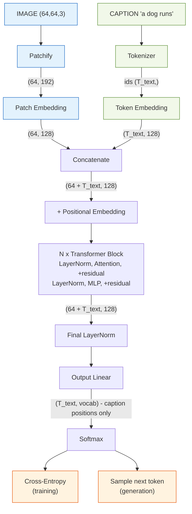
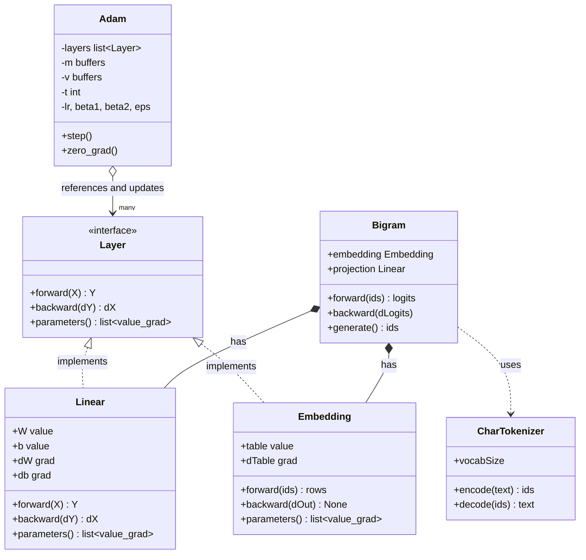
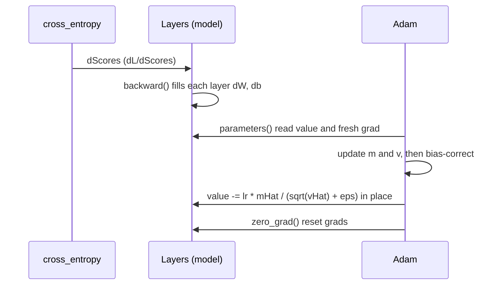

# Implementation Plan — Image Captioning Transformer from Scratch

The **build spec**. For the theory behind each step, see [LEARNING.md](LEARNING.md)
(same step numbers).

> **Golden rule:** anything with a backward pass isn't done until a **finite-difference
> gradient check passes** (built in Step 0).

---

## Task

Build a **decoder-only Transformer that generates a text caption for an image**, entirely
from scratch in NumPy (Track 3). Given a new image, the model outputs a sentence describing
it, one token at a time. Captioning = next-token language modeling conditioned on an image.

- **Dataset:** Flickr8k (real photos + human captions), downscaled, ~1–2k-image subset.
- **Deliverable:** a Jupyter notebook that runs start→finish + a ~6-page report.
- **Constraint:** network from scratch; only NumPy for the model (sklearn/Matplotlib for
  prep/plots, tokenizer may be self-written).

---

## Architecture overview

This is the **actual working process** — the forward data-flow the model runs to turn an
image + caption tokens into next-token predictions. It's shared by both modes and only
differs at the very end: **training** feeds the predictions into cross-entropy; **generation**
samples the next token and loops. (The optimizer/learning view is the class diagram below.)

Shapes use `d_model=128`, 64×64 image, 8×8 patches → 64 image tokens.



## Components & connections

| Component | Responsibility | In → Out | Connects |
|---|---|---|---|
| **Image preprocess** *(offline)* | decode + resize to fixed size, save as array | JPEG → `(64,64,3)` | feeds Patchify |
| **Patchify** | cut image into non-overlapping patches, flatten each | `(64,64,3)` → `(64, 192)` | → Patch Embedding |
| **Patch Embedding** | Linear projecting each patch to model width → "image tokens" | `(64, 192)` → `(64, 128)` | → Concatenate |
| **Tokenizer** | caption text ↔ integer ids; adds `<bos>`/`<eos>` | text → `(T_text,)` | → Token Embedding |
| **Token Embedding** | lookup table: id → learned vector | `(T_text,)` → `(T_text,128)` | → Concatenate |
| **Concatenate** | build one sequence: image tokens then caption tokens | → `(64+T_text, 128)` | → Positional |
| **Positional Embedding** | add position info (attention is order-blind without it) | same shape | → Blocks |
| **LayerNorm** | normalize features per token; stabilizes training | `(T,128)` → `(T,128)` | inside each block (×2) + final |
| **Multi-Head Attention** | mix info across positions; **image unmasked, caption causal** | `(T,128)` → `(T,128)` | core of each block |
| **Residual** | add sublayer input back to output; keeps gradients flowing | same shape | wraps attention + MLP |
| **MLP** (Linear→GELU→Linear) | per-token nonlinear transform (×4 width expand) | `(T,128)` → `(T,128)` | second sublayer of block |
| **Transformer Block ×N** | one round of "attend, then think"; stacked for depth | `(T,128)` → `(T,128)` | chained N times |
| **Final LayerNorm** | normalize before the output projection | `(T,128)` → `(T,128)` | → Output Linear |
| **Output Linear** (LM head) | project each token to vocabulary-sized logits | `(T,128)` → `(T,vocab)` | → Softmax |
| **Softmax** | logits → probability distribution over next token | `(T,vocab)` | → loss / sampling |
| **Cross-Entropy** *(train)* | error vs. true next token, **caption positions only** | → scalar loss | drives backprop |
| **Generation** *(inference)* | sample next token, append, repeat until `<eos>` | → caption text | the demo |

**Key connections:**
- **Two modalities, one sequence** — patch and token embeddings both output `d_model`
  vectors, so attention mixes image + text in the same space.
- **Split mask** — image tokens see everything; caption tokens are causal.
- **Loss ignores image positions** — only caption tokens have a "correct next token."
- **One block = attend, then process** — attention shares info between tokens; MLP transforms
  each token; residual + LayerNorm keep the stack trainable.

## Input / Output

- **Training input:** `(image (64,64,3), caption ids (T_text,))` pairs.
- **Training output:** scalar cross-entropy loss on caption positions → gradients.
- **Inference input:** one image `(64,64,3)`.
- **Inference output:** a caption string, generated token by token until `<eos>`.

**Runtime (inference) flow** — image encoded once, caption built autoregressively:
```
encode image ONCE → 64 image tokens
start: [image tokens | <bos>]
loop until <eos>/max-len:
   forward pass → take probs at LAST position → pick token → append
```
| Iter | Model input | Predicts | Caption |
|---|---|---|---|
| 1 | `[img] <bos>` | `a` | a |
| 2 | `[img] <bos> a` | `dog` | a dog |
| 3 | `[img] <bos> a dog` | `runs` | a dog runs |
| 4 | `[img] <bos> a dog runs` | `<eos>` | **done** |

## Software design (components & responsibilities)

Four kinds of component, each with one responsibility:
**layers compute**, the **loss** scores + seeds backprop, the **optimizer** updates,
the **tokenizer** converts text ↔ ids. Layers share one interface so the optimizer treats
them all the same.

### Layer (interface)
```
Layer   (Linear, Embedding, Attention, ...)   →  COMPUTE
    - holds params (values) + grads (filled by backward)
    - forward(), backward()
    - parameters() -> [(value, grad), ...]   # uniform interface for the optimizer
    - zero_grad()
```

### Linear  — fully-connected layer  `Y = X @ W + b`
```
    - params: W (n_in, n_out), b (n_out)   ; grads: dW, db
    - forward(X)   -> X @ W + b            ; caches X
    - backward(dY) -> dX                   ; fills dW = X.T @ dY, db = sum(dY)
    - parameters() -> [(W, dW), (b, db)]
```

### Embedding  — token id → learned vector
```
    - param: table (vocabSize, d)          the ONE parameter (no bias) ; grad: dTable
    - forward(ids)   -> table[ids]         row lookup ; caches ids
    - backward(dOut) -> None               scatter-add into dTable (np.add.at)
    - parameters()   -> [(table, dTable)]
```
Differs from Linear in two ways: backward is **scatter-add** (duplicate ids accumulate),
and it returns **no input gradient** (`None`) — integer ids aren't differentiable and it's
always the first layer. Same `parameters()` contract, so the optimizer needs no special case.

### cross_entropy  — the loss (a function, NOT a Layer)
```
    - cross_entropy(scores, targets) -> (meanLoss, gradientWrtScores)
    - no parameters ; seeds backprop with gradientWrtScores = (softmax - onehot) / batch
```

### Adam  — the optimizer
```
    - references the layers            self.layers
    - per-param state: m, v (buffers, zeros, same shapes)
    - shared state:    t, lr, β1, β2, ε
    - step():  loop all params -> Adam update in place (reads grads fresh each step)
    - zero_grad(): reset every layer's grads
```

### CharTokenizer  — text ↔ ids (utility, NOT a Layer)
```
    - idToToken / tokenToId : the vocabulary (incl. <pad>, <bos>, <eos>)
    - encode(text) -> [ids]   (optionally wraps with <bos>/<eos>)
    - decode([ids]) -> text   (optionally skips special tokens)
    - vocabSize
```

### Models — assembled from the components above
```
Bigram   : Embedding(vocab, d) -> Linear(d, vocab) -> cross_entropy -> Adam
           predicts next token from ONLY the current token
           trained on shift-by-one pairs: inputs = ids[:-1], targets = ids[1:]
           generate(): <bos> -> embed -> Linear -> softmax -> sample -> until <eos>

Captioner: Embedding + PatchEmbedding -> [Transformer blocks] -> Linear -> cross_entropy
           (the same skeleton; later steps slot layers into the middle)
```

**Class relationship (training-time view):**

This shows the **learning process** — `Adam` (and `cross_entropy`) exist only while training.
At **generation time** they drop out: only `CharTokenizer` + the trained model (`Bigram` →
`Embedding` + `Linear`) run, via `generate()`.



**One training step (how they interact):**


**Two correctness rules:**
- **Update in place** — `value -= …` (not `value = value − …`), else the layer's `W` never changes.
- **Read grads fresh each step** — `backward()` rebinds `dW`/`db` to new arrays, so `step()`
  must call `parameters()` each time; values are safe to hold, grads are not.

---

## Deliverables (the executable)

| Artifact | What it is |
|---|---|
| **`captioning.ipynb`** | the deliverable — all code + markdown, runs start→finish |
| **`model.py`** *(optional)* | from-scratch modules, imported by the notebook |
| **`weights.npy`** | trained parameters, so the demo runs without retraining |
| **`report.pdf`** | ~6-page GPT report |

Core demo cell: `caption = generate(model, image); print(caption)` + attention overlay.

---

## Build order & verification

Build bottom-up; each row reuses the ones above. Nothing with a backward pass is done until
its **gradient check passes**. (Theory for each is in [LEARNING.md](LEARNING.md).)

| Build | Verify (done when) |
|---|---|
| `numerical_gradient`, `stable_softmax` | grad of `x²` is `2x`; softmax safe for `x + 1000` |
| `Linear` (+ activation, MLP) | grad checks on `dW/db/dX` pass; MLP solves XOR |
| `cross_entropy`, `Adam` | loss falls, weights change in place, fits a learnable task; grad check passes |
| `CharTokenizer`, `Embedding`, Bigram + `generate` | tokenizer round-trips; embedding grad check; loss `< ln(vocab)`; forms letter patterns |
| Attention (causal, multi-head) ⭐ | grad checks pass; changing a future token doesn't change earlier outputs |
| `LayerNorm`, Transformer block, char-GPT | grad check; val loss drops; word-like text — ✅ **valid Track-3 project reached** |
| `patchify`, `PatchEmbedding`, joint sequence | shapes correct; image unmasked / caption causal; end-to-end grad check |
| Train captioner + `generate(image)` | clean train/val curves; captions relate to held-out images |
| Diagnostics + grounding analysis | overfit 2 examples → ~0 loss; some words ground to sensible regions |

**Safety net:** the char-GPT row already gives a submittable Track-3 text GPT; the rows below
it are the multimodal upgrade on top.
