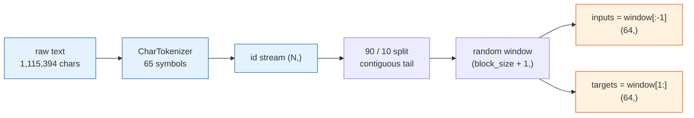
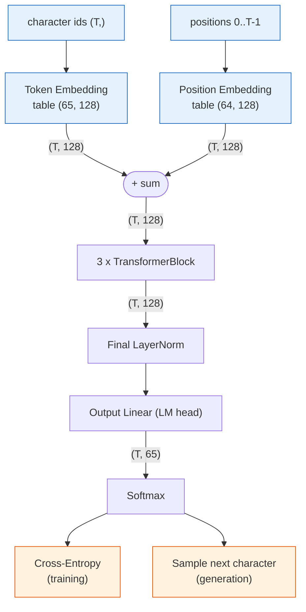
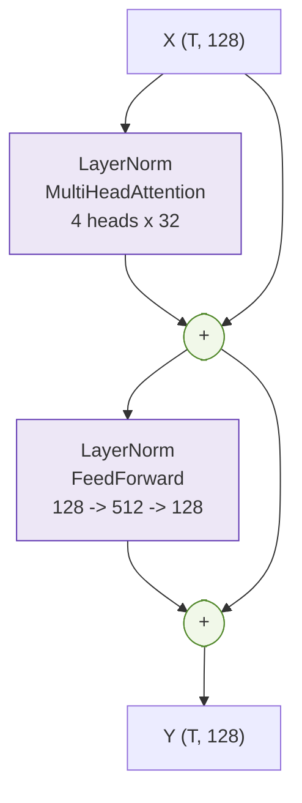
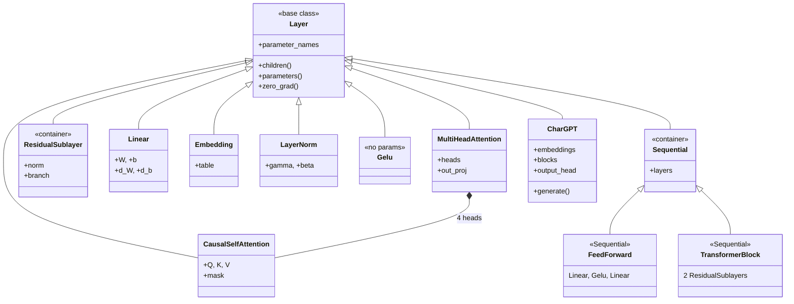
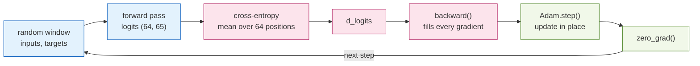
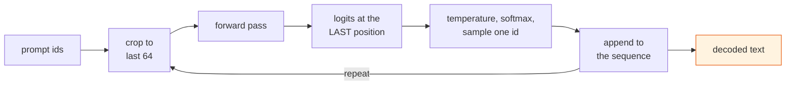

# A Character-Level GPT Implemented from Scratch in NumPy

**Foundations of Machine Learning — Final Project, Track 3 (GPT Report)**

## 1. Problem and Approach

The task is to predict the next character of Shakespeare play text, given the preceding ones.
Character-level modelling has no word boundaries and no English vocabulary, so the network has to
pick up spelling, grammar and the layout of a play from next-character prediction alone. The
decoder-only Transformer is written in NumPy with no autograd: every backward pass is derived by
hand and checked against finite differences.

| | |
|---|---|
| **Task** | Next-character prediction (autoregressive language modelling) |
| **Data** | Tiny Shakespeare, 1,115,394 characters, 90/10 split |
| **Model** | 619,969 parameters, `d_model=128`, 4 heads, 3 blocks, 64-character context |
| **Result** | 1.821 nats/char held out (perplexity 6.18; uniform baseline 65) |
| **Tools** | NumPy for the model, Matplotlib for plots, Python stdlib for file I/O |
| **Scope** | Text only. An earlier multimodal captioning proposal is not part of this submission. |

## 2. Dataset and Tokenization

The tokenizer maps text to the integer ids the model consumes. The pipeline below is built once at
start-up and then sampled at every training step:



Reading the diagram left to right:

1. **Build the vocabulary** from the distinct characters in the corpus, sorted. There are 65 of
   them, so the tokenizer is two dictionaries, `char → id` and `id → char`.
2. **Encode once** into a flat array of ids, shape `(1115394,)`. Training never re-tokenizes.
3. **Split by position, not by shuffling.** The last 10% is held out as one contiguous block.
   Training windows overlap, so a shuffled split would put almost the same characters in both sets
   and the validation loss would measure memorisation.
4. **Sample a window:** a random start index and `block_size + 1 = 65` ids.
5. **Shift by one for labels:** `inputs = window[:-1]`, `targets = window[1:]`. The target at
   position `t` is the character that follows input `t`. That shift is the only supervision.

**Why character level.** The tokenizer stays two dictionaries and the output layer has 65 rows
instead of tens of thousands, which helps when every backward pass is written by hand. The
downside is context: 64 characters is about a dozen words. BPE would pack more text into the same
window, but it would not change the Transformer, which only sees integers.

## 3. Architecture

### 3.1 Forward data-flow

Shapes below use `d_model = 128`, context `T ≤ 64`, vocabulary 65. Training and generation share
this path and differ only at the last step.



Step by step through the diagram:

1. **Look up each character** in the token embedding table. `T` ids become `T` vectors of width
   128. This is a row lookup, not a matrix product.
2. **Look up each position** `0 … T-1` in a second table of the same width. Without position
   vectors the model would be permutation-invariant: it would see which characters appear, but not
   their order.
3. **Add the two tables.** Addition keeps width 128 (concatenation would not) and sends the same
   gradient back into both tables. The position table has `max_sequence_length = 64` rows, so that
   table is the context window. Generation has to crop to the last 64 characters or the lookup
   goes out of range.
4. **Pass through 3 Transformer blocks.** Each mixes information across positions and then
   transforms each position (§3.3). The shape stays `(T, 128)`, so blocks can be stacked.
5. **Normalise once more**, then project with the LM head: `(T, 128)` becomes `(T, 65)` logits, one
   score per vocabulary character at every position.
6. **Softmax to probabilities.** Training compares all `T` distributions to the true next
   characters. Generation samples only from the last position.

### 3.2 Components

| Component | Responsibility | In → Out |
|---|---|---|
| **CharTokenizer** | text ↔ integer ids; owns the vocabulary | text → `(T,)` |
| **Embedding** | id → learned vector, by row lookup; used for tokens *and* positions | `(T,)` → `(T,128)` |
| **LayerNorm** | normalise each token across features, then scale/shift | `(T,128)` → `(T,128)` |
| **CausalSelfAttention** | one attention pattern; mixes information *across* positions, causally | `(T,128)` → `(T,32)` |
| **MultiHeadAttention** | 4 heads in parallel, concatenated and projected | `(T,128)` → `(T,128)` |
| **FeedForward** | `Linear → GELU → Linear` with ×4 width; transforms *each* token alone | `(T,128)` → `(T,128)` |
| **ResidualSublayer** | `X + branch(norm(X))`; keeps gradients flowing | same shape |
| **TransformerBlock** | attention followed by the MLP | `(T,128)` → `(T,128)` |
| **Linear** (LM head) | project each position to vocabulary scores | `(T,128)` → `(T,65)` |
| **cross_entropy** | error against the true next character; seeds backprop | → scalar |
| **Adam** | per-parameter adaptive update, in place | — |

- **Causal mask.** Future scores are set to `−∞` before the softmax, so position `i` cannot see
  `> i`. That is also why one forward pass can score all 64 next-character predictions at once.
- **Scaling by `√d_head`.** A dot product of `d_head`-dimensional vectors has variance
  proportional to `d_head`. Unscaled scores saturate the softmax and the gradient vanishes.
- **Four heads instead of one.** The layer can attend in several ways at the same parameter count.
  The sweep in §5.3 puts the gap at 0.12 nats.
- **GELU instead of ReLU.** GELU is smooth, so there is no region where the gradient is exactly
  zero.

### 3.3 Inside one Transformer block

Each block is two residual sub-layers. Normalisation sits inside the branch (pre-norm), not after
the addition (post-norm, as in Vaswani et al. 2017). Pre-norm leaves the residual stream
un-normalised from input to output and is more stable at this depth.



The residual connection also fixes the backward pass: a gradient at an addition is copied to both
paths, so `ResidualSublayer.backward` is `d_y + norm.backward(branch.backward(d_y))`. The extra
`d_y` is the skip path. Without it, stacking several blocks would make the embedding gradient very
small.

### 3.4 Model size

| Component | Parameters | Share |
|---|---:|---:|
| Token embedding (65 × 128) | 8,320 | 1.3 % |
| Positional embedding (64 × 128) | 8,192 | 1.3 % |
| 3 × TransformerBlock | 594,816 | 95.9 % |
| Final LayerNorm + LM head | 8,641 | 1.4 % |
| **Total** | **619,969** | |

Within one block (198,272 parameters) the MLP has 131,712 (66%), attention 66,048 (33%) and the two
LayerNorms 512 (0.3%). Most of the capacity is in the position-wise MLP, not in attention.

### 3.5 Code structure

Every layer subclasses a small `Layer` base. A layer either lists the arrays it owns in
`parameter_names` (the gradient of `W` is stored in `d_W`) or returns child layers from
`children()`. `parameters()` and `zero_grad()` are implemented once on the base class and recurse.
No subclass writes those two methods. `Adam` walks the model with a single call.



The composition matches the flowcharts: `CharGPT` holds two `Embedding` tables, a `Sequential` of
three `TransformerBlock`s and a `Sequential` output head. Each block holds two `ResidualSublayer`s,
each with a `LayerNorm` and a branch.

Collecting parameters this way avoids a silent bug: a sub-layer left out of the optimizer never
trains, the loss still falls, and nothing reports an error.

## 4. Training

### 4.1 One training step



Blue is the forward pass, pink the backward pass, green the optimizer.

Training minimises mean cross-entropy over all 64 positions in the window (teacher forcing). The
model always conditions on the true prefix, and the causal mask makes every position a valid
example, so one forward pass gives 64 labelled predictions.

Two implementation details caused bugs before they were fixed. Parameters have to be updated in
place: assigning a new array leaves the layer holding the old one. Gradients have to be re-read
every step, because each `backward()` allocates new gradient arrays.

### 4.2 Generation



Temperature divides the logits before the softmax: below 1 sharpens the distribution toward the
model's favourites, above 1 flattens it toward uniform.

### 4.3 Hyperparameters and why

| Setting | Value | Why this value |
|---|---|---|
| Context `block_size` | 64 | Smallest window spanning a line of verse, which the speaker-name-then-line layout needs |
| `d_model` | 128 | Narrower loses 0.09 nats (§5.3); wider stops training in minutes |
| Heads | 4 | Leaves 32 dimensions per head, the usual range; one head loses 0.12 nats |
| Blocks | 3 | Largest depth that still trains in minutes without batching |
| MLP width | 512 | The standard ×4 expansion inside the block |
| Learning rate | 5 × 10⁻⁴ | An order of magnitude below a mini-batch setting: each step sees a **single window**, so the gradient is noisy and a large step amplifies the noise instead of averaging it away |
| Steps | 16,000 | Where the validation curve flattens (§5.1); a few minutes on a laptop CPU |
| Optimizer | Adam, `β = (0.9, 0.999)`, `ε = 10⁻⁸` | Defaults; per-parameter scaling matters when embedding and attention gradients differ by orders of magnitude |

## 5. Results

### 5.1 Learning behaviour


Each raw point is one window, so the curve is noisy (dialogue is easier than a stretch of proper
nouns). The validation estimate is not monotone: it rises from 1.949 to 1.989 near step 9,000.
That is variance from 20 windows, not overfitting. Overfitting would look like training still
falling while validation turns up. The final train/validation gap is 0.127 nats and stays there.

### 5.2 Evaluation

| Metric | Value |
|---|---|
| Validation loss | **1.821** nats / character (from 2.493) |
| Validation perplexity | **6.18** |
| Uniform baseline perplexity | 65.0 |
| Improvement over random guessing | **10.5 ×** |
| Train / validation gap | 0.127 nats |

Perplexity is `exp(loss)`: how many characters the model is effectively choosing between. On
held-out text that number is about six, down from 65.

*Sample at temperature 0.8, and a continuation of the prompt `ROMEO:`*

```
Come, the so, for childst of you.        ROMEO:
                                         What Duke in ply pure,
RICHARD:                                 And so, I say them the now see compled be may sit?
What thou.                               To make come made quiciague, then now way, is
                                         roping down homs,
QUEEN MARGARET:
Whe surping this god Glord, pition eye a stand men:
```

Spelling and punctuation are mostly right, and the play layout (speaker name, colon, verse line)
shows up without being encoded as a special format. Corpus names appear (`RICHARD:`,
`QUEEN MARGARET:`); at temperature 1.0 so does `DUKE VINCENHIO:`, a misspelling of Duke Vincentio,
so names are built character by character. Meaning does not hold together, which is expected at a
64-character context.

### 5.3 Hyperparameter study

Six configurations on an equal 2,000-step budget, each varying one factor:

| Configuration | `d_model` | Heads | Blocks | LR | Parameters | Val. loss |
|---|---:|---:|---:|---:|---:|---:|
| shallower (1 block) | 128 | 4 | 1 | 5e-04 | 223,425 | **2.336** |
| baseline | 128 | 4 | 3 | 5e-04 | 619,969 | 2.365 |
| narrower (`d_model` 64) | 64 | 4 | 3 | 5e-04 | 162,561 | 2.458 |
| single head | 128 | 1 | 3 | 5e-04 | 619,969 | 2.484 |
| lr 5× lower | 128 | 4 | 3 | 1e-04 | 619,969 | 2.486 |
| lr 10× higher | 128 | 4 | 3 | 5e-03 | 619,969 | 2.660 |

Learning rate is the largest effect: ten times higher costs 0.30 nats, more than any architecture
change in the table. Four heads beat one head by 0.12 nats at the same parameter count, so the
gain is from attending in several ways, not from extra weights.

The one-block row looks best, but a 2,000-step budget measures early speed, not the final model.
Smaller networks drop faster at first and then lag: over 16,000 steps the three-block model reaches
1.82. A short sweep is useful for discarding bad settings. It is not enough to choose the
architecture, and each row is a single seed.

## 6. Lessons Learned and Challenges

- **Gradient checks miss scaling bugs.** An early version stalled near loss 2.5 while every
  gradient check passed. `Linear` sampled weights from a standard normal without `1/√n_in`, so
  activations grew by about `√n_in` per layer and training started at 14.8 instead of 4.17.
  Finite differences only show that the gradient matches the forward pass. They do not show that
  the forward pass is scaled correctly; that shows up in the initial loss.
- **The softmax Jacobian was the hardest derivation.** Every output depends on every input:
  `∂L/∂s = p ⊙ (∂L/∂p − Σ(∂L/∂p ⊙ p))`. LayerNorm has the same kind of coupling. Differentiating
  element-wise looks almost right and then trains poorly.
- **No batching.** Layers take a single sequence, which kept every backward pass small enough to
  check entry by entry. The cost is one window per step, a small learning rate and a noisy curve.
- **Fixed seeds are not bit-identical.** Matrix products are not associative in floating point, and
  thousands of steps amplify the difference, so numbers are quoted to two decimals.
- **What to do next.** Add a batch axis, then BPE, then more parameters. At this size the
  64-character context is the limit on coherence, not the parameter count.

## References

1. Vaswani, A. et al. (2017). *Attention Is All You Need.* NeurIPS.
2. Radford, A. et al. (2019). *Language Models are Unsupervised Multitask Learners.* (GPT-2.)
3. Karpathy, A. (2023). *Let's build GPT: from scratch, in code, spelled out*; nanoGPT repository.
4. Ba, J. L., Kiros, J. R., & Hinton, G. E. (2016). *Layer Normalization.* arXiv:1607.06450.
5. Xiong, R. et al. (2020). *On Layer Normalization in the Transformer Architecture.* ICML.
6. Kingma, D. P., & Ba, J. (2015). *Adam: A Method for Stochastic Optimization.* ICLR.
7. Hendrycks, D., & Gimpel, K. (2016). *Gaussian Error Linear Units (GELUs).* arXiv:1606.08415.
8. Glorot, X., & Bengio, Y. (2010). *Understanding the difficulty of training deep feedforward
   neural networks.* AISTATS.
