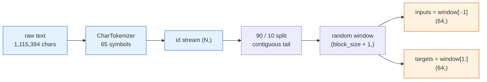
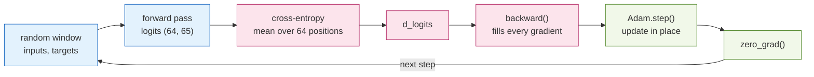
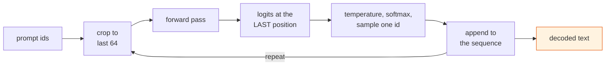
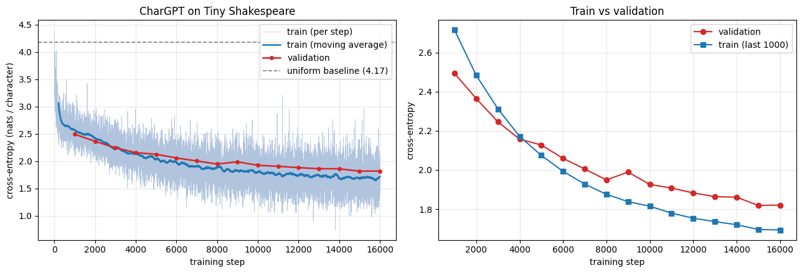

# A Character-Level GPT Implemented from Scratch in NumPy

**Foundations of Machine Learning — Final Project, Track 3 (GPT Report)**

**Authors:** *[names here]*

---

## 1. Problem and Approach

Predict the next **character** of Shakespeare play text, given the preceding ones. At character
level the model is handed no linguistic scaffolding — no word boundaries, no English vocabulary —
so spelling, grammar and the layout of a play have to be inferred from that one instruction. The
whole decoder-only Transformer is built **without an autograd framework**: every backward pass is
derived by hand and checked against finite differences.

| | |
|---|---|
| **Task** | Next-character prediction (autoregressive language modelling) |
| **Data** | Tiny Shakespeare, 1,115,394 characters, 90/10 split |
| **Model** | 619,969 parameters — `d_model=128`, 4 heads, 3 blocks, 64-character context |
| **Result** | 1.821 nats/char held out — perplexity 6.18 against a baseline of 65 |
| **Tools** | NumPy for the model, Matplotlib for plots, Python stdlib for file I/O |
| **Scope** | Text only; the multimodal captioning extension proposed earlier is not included |

## 2. Dataset and Tokenization

The tokenizer turns text into the integers the model actually consumes, and the pipeline below is
run once at start-up, then sampled from at every training step:



Reading the diagram left to right:

1. **Build the vocabulary** from the distinct characters of the corpus, sorted — **65 symbols**, so
   the tokenizer is two dictionaries, `char → id` and `id → char`.
2. **Encode once** into one flat array of ids, `(1115394,)`. Nothing is re-tokenized later.
3. **Split by position, not at random.** The last 10 % is held out as one contiguous block. A
   shuffled split would leak, because training windows overlap: a validation window would share most
   of its characters with a training one, and we would be measuring memorisation.
4. **Sample a window** — a random start index and `block_size + 1 = 65` ids.
5. **Shift by one to make the labels:** `inputs = window[:-1]`, `targets = window[1:]`. This shift
   *is* the supervision signal; the text is its own answer key.

**Why character level.** It keeps the tokenizer trivial and the output layer small — 65 rows rather
than tens of thousands — which matters when every backward pass is hand-written. The cost is reach:
64 characters is about a dozen words. BPE would fit more text into the same window but would not
change the Transformer, which never sees anything but integers.

**Why no `<bos>`/`<eos>`/`<pad>`.** The corpus is one continuous stream, so there is no boundary to
mark and, with one sequence per step, nothing to pad. Added anyway, they would never occur in
training and their embedding rows would stay at their random initial values.

Every result is measured against `ln(65) = 4.174` nats/char, the loss of uniform guessing.

## 3. Architecture

### 3.1 Forward data-flow

Shapes below use `d_model = 128`, context `T ≤ 64`, vocabulary 65. Training and generation share
this entire path and differ only at the last step.


Step by step through the diagram:

1. **Look up each character** in the token embedding table, turning `T` ids into `T` vectors of
   width 128 — a row lookup, not a matrix product.
2. **Look up each position** `0 … T-1` in a second table of the same width. Without it the model
   would be permutation-invariant — it could see *which* characters precede, but not in what order.
3. **Add the two.** Adding rather than concatenating keeps the width fixed at 128 and means
   backward simply routes the same gradient into both tables. Note the position table has exactly
   `max_sequence_length = 64` rows, so **that table is the context window**; generation must crop
   its input to the last 64 characters or the lookup would run off the end.
4. **Pass through 3 Transformer blocks.** Each mixes information across positions and then
   transforms each position (§3.3). The shape never changes, so blocks stack freely.
5. **Normalise once more**, then **project to vocabulary scores** with the LM head: `(T, 128)`
   becomes `(T, 65)` logits, one score per possible next character at every position.
6. **Softmax to probabilities**, and here the two uses diverge — training compares all `T`
   distributions against the true next characters, generation samples only from the last one.

### 3.2 Components

| Component | Responsibility | In → Out |
|---|---|---|
| **CharTokenizer** | text ↔ integer ids; owns the vocabulary | text → `(T,)` |
| **Embedding** | id → learned vector, by row lookup; used for tokens *and* positions | `(T,)` → `(T,128)` |
| **LayerNorm** | normalise each token across features, then scale/shift | `(T,128)` → `(T,128)` |
| **CausalSelfAttention** | one attention pattern; mixes information *across* positions, causally | `(T,128)` → `(T,32)` |
| **MultiHeadAttention** | 4 heads in parallel, concatenated and projected | `(T,128)` → `(T,128)` |
| **FeedForward** | `Linear → GELU → Linear` with ×4 width; transforms *each* token alone | `(T,128)` → `(T,128)` |
| **ResidualSublayer** | `X + branch(norm(X))`; keeps gradients flowing | same shape |
| **TransformerBlock** | one round of "attend, then think" | `(T,128)` → `(T,128)` |
| **Linear** (LM head) | project each position to vocabulary scores | `(T,128)` → `(T,65)` |
| **cross_entropy** | error against the true next character; seeds backprop | → scalar |
| **Adam** | per-parameter adaptive update, in place | — |

- **Causal mask** — future scores are set to `−∞` before the softmax. This is what makes the model
  a language model, and why one forward pass can be trained on all 64 next-character predictions at
  once instead of just the last.
- **Scaling by `√d_head`** — a dot product of `d_head`-dimensional vectors has variance
  proportional to `d_head`, and unscaled scores saturate the softmax into a near one-hot
  distribution whose gradient vanishes.
- **Four heads, not one** — the layer attends several ways at once for identical parameter count.
  Worth 0.12 nats in the sweep (§6.3).
- **GELU, not ReLU** — smooth everywhere, so it has no dead region where the gradient is exactly
  zero.

### 3.3 Inside one Transformer block

Each block is two residual sub-layers, with normalisation applied **inside** the branch (pre-norm)
rather than after the addition (post-norm, as in the 2017 paper). Pre-norm leaves the residual
stream un-normalised end to end and trains far more stably at depth.


**The residual rule drives the backward pass:** a gradient arriving at an addition flows to *both*
paths unchanged, so `ResidualSublayer.backward` is `d_y + norm.backward(branch.backward(d_y))`. The
bare `d_y` term is the skip path, and it is why a deep stack stays trainable — there is always an
unobstructed route back to the embeddings.

### 3.4 Model size

| Component | Parameters | Share |
|---|---:|---:|
| Token embedding (65 × 128) | 8,320 | 1.3 % |
| Positional embedding (64 × 128) | 8,192 | 1.3 % |
| 3 × TransformerBlock | 594,816 | 95.9 % |
| Final LayerNorm + LM head | 8,641 | 1.4 % |
| **Total** | **619,969** | |

Within one block of 198,272 parameters, the MLP holds 131,712 (66 %), attention 66,048 (33 %) and
the two LayerNorms 512 (0.3 %). Attention gets most of the conceptual attention; the position-wise
MLP quietly holds two thirds of the capacity.

### 3.5 Code structure

Every layer derives from a small `Layer` base class. A layer declares either the parameter arrays
it owns (`parameter_names`, where the gradient of `W` lives in `d_W`) or the child layers it is
composed of (`children()`), and `parameters()`/`zero_grad()` are derived from those two hooks
recursively. **No subclass implements either method**, and `Adam` walks the whole model through one
call.


Composition is read off the two flowcharts above: `CharGPT` holds the two `Embedding` tables, a
`Sequential` of three `TransformerBlock`s and a `Sequential` output head; each block holds two
`ResidualSublayer`s, each of which holds a `LayerNorm` and its branch.

This is not merely tidiness. Parameter collection is exactly the code that fails **silently** in a
hand-written model: a sub-layer left out of the optimizer's list simply never trains, the loss
still falls, and nothing reports an error. Deriving it once removes the possibility.

## 4. Training

### 4.1 One training step



Blue is the forward pass, pink the backward pass, green the optimizer.

Training minimises the mean cross-entropy over **all 64 positions** in the window. This is teacher
forcing: the model always conditions on the true prefix, and the causal mask makes every position a
legitimate example, so one forward pass yields 64 supervised predictions rather than one.

Two implementation rules are load-bearing, and both caused bugs. Parameters must be updated **in
place**, since rebinding the name leaves the layer holding its old array; gradients must be
**re-read every step**, since each `backward()` binds fresh arrays.

### 4.2 Generation



| Iteration | Model input | Predicts |
|---|---|---|
| 1 | `R O M E O :` | `\n` |
| 2 | `R O M E O : \n` | `W` |
| 3 | `… W` | `h` |

Temperature divides the logits before the softmax: below 1 sharpens the distribution toward the
model's favourites, above 1 flattens it toward uniform.

### 4.3 Hyperparameters and why

| Setting | Value | Why this value |
|---|---|---|
| Context `block_size` | 64 | Smallest window spanning a line of verse, which the speaker-name-then-line layout needs |
| `d_model` | 128 | Narrower loses 0.09 nats (§6.3); wider stops training in minutes |
| Heads | 4 | Leaves 32 dimensions per head, the usual range; one head loses 0.12 nats |
| Blocks | 3 | Largest depth that still trains in minutes without batching |
| MLP width | 512 | The standard ×4 expansion inside the block |
| Learning rate | 5 × 10⁻⁴ | An order of magnitude below a mini-batch setting: each step sees a **single window**, so the gradient is noisy and a large step amplifies the noise instead of averaging it away |
| Steps | 16,000 | Where the validation curve flattens (§6.1); a few minutes on a laptop CPU |
| Optimizer | Adam, `β = (0.9, 0.999)`, `ε = 10⁻⁸` | Defaults; per-parameter scaling matters when embedding and attention gradients differ by orders of magnitude |

## 5. Results

### 5.1 Learning behaviour



Each raw point is a single window, and flowing dialogue is far easier than a line full of proper
nouns, hence the noise. The validation estimate is not monotone — it rises from 1.949 to 1.989 near
step 9,000 — but that is the variance of an estimate from 20 windows, not overfitting: memorisation
would show training still falling while validation turns up. The final gap of **0.127 nats** is
stable, so the model is still learning transferable structure.

### 5.2 Evaluation

| Metric | Value |
|---|---|
| Validation loss | **1.821** nats / character (from 2.493) |
| Validation perplexity | **6.18** |
| Uniform baseline perplexity | 65.0 |
| Improvement over random guessing | **10.5 ×** |
| Train / validation gap | 0.127 nats |

Perplexity is `exp(loss)`, the number of characters the model is effectively choosing between: on
unseen text it has narrowed 65 possibilities to about six.

*Sample at temperature 0.8, and a continuation of the prompt `ROMEO:`*

```
Come, the so, for childst of you.        ROMEO:
                                         What Duke in ply pure,
RICHARD:                                 And so, I say them the now see compled be may sit?
What thou.                               To make come made quiciague, then now way, is
                                         roping down homs,
QUEEN MARGARET:
Whe surping this god Glord, pition eye a stand men:
```

Structure well above the character level has been learned: spelling is mostly correct, punctuation
lands plausibly, and the **play format was acquired without being told it exists** — capitalised
speaker names ending in a colon, then verse lines of the right length. Real corpus characters
appear (`RICHARD:`, `QUEEN MARGARET:`), and at temperature 1.0 `DUKE VINCENHIO:` — a near-miss on
Duke Vincentio, showing names are rebuilt character by character, not recalled whole. What is
absent is meaning: clauses are grammatically shaped but do not compose, which is expected when a
64-character window cannot hold a whole speech.

### 5.3 Hyperparameter study

Six configurations on an equal 2,000-step budget, each varying one factor:

| Configuration | `d_model` | Heads | Blocks | LR | Parameters | Val. loss |
|---|---:|---:|---:|---:|---:|---:|
| shallower (1 block) | 128 | 4 | 1 | 5e-04 | 223,425 | **2.336** |
| baseline | 128 | 4 | 3 | 5e-04 | 619,969 | 2.365 |
| narrower (`d_model` 64) | 64 | 4 | 3 | 5e-04 | 162,561 | 2.458 |
| single head | 128 | 1 | 3 | 5e-04 | 619,969 | 2.484 |
| lr 5× lower | 128 | 4 | 3 | 1e-04 | 619,969 | 2.486 |
| lr 10× higher | 128 | 4 | 3 | 5e-03 | 619,969 | 2.660 |

**The learning rate dominates:** tenfold higher costs 0.30 nats, more than any architectural change
tested. **Multiple heads earn their place**, beating one head by 0.12 nats at identical parameter
count, so the gain comes from attending several ways at once, not from capacity.

The one-block model topping the table is a trap: a 2,000-step budget ranks **early learning speed**,
not final quality. Smaller models converge faster and finish worse — over the full 16,000 steps the
three-block model reaches 1.82. A short sweep rules settings *out*; it does not choose an
architecture, and each row is a single seed.

## 6. Lessons Learned and Challenges

- **Gradient checks do not catch scaling bugs.** An early version stalled near 2.5 while *every*
  gradient check passed: `Linear` drew weights from a standard normal without the `1/√n_in` factor,
  so activations grew by ≈ `√n_in` per layer and training started at loss 14.8 instead of 4.17. A
  finite-difference check only proves the gradient matches the forward pass, not that the forward
  pass is well scaled — that bug is visible in the initial loss.
- **The softmax Jacobian was the hardest derivation**, being the one place where every output
  depends on every input: `∂L/∂s = p ⊙ (∂L/∂p − Σ(∂L/∂p ⊙ p))`. LayerNorm has the same shape of
  problem. The trap is to differentiate element-wise and get something that trains almost-but-not-quite.
- **Skipping batching was a deliberate trade.** Single-sequence layers kept every backward pass
  small enough to gradient-check element by element; the cost is one window per step, forcing a
  small learning rate and a noisy loss curve.
- **Fixed seeds do not give bit-identical runs.** Floating-point matrix products are not
  associative, and thousands of steps amplify the difference, so results are quoted to two decimals.
- **Next steps:** add a batch axis, then BPE tokens, and only then more parameters — at this size
  coherence is limited by the 64-character context, not by capacity.

## References

1. Vaswani, A. et al. (2017). *Attention Is All You Need.* NeurIPS.
2. Radford, A. et al. (2019). *Language Models are Unsupervised Multitask Learners.* (GPT-2.)
3. Karpathy, A. (2023). *Let's build GPT: from scratch, in code, spelled out*; nanoGPT repository.
4. Ba, J. L., Kiros, J. R., & Hinton, G. E. (2016). *Layer Normalization.* arXiv:1607.06450.
5. Xiong, R. et al. (2020). *On Layer Normalization in the Transformer Architecture.* ICML.
6. Kingma, D. P., & Ba, J. (2015). *Adam: A Method for Stochastic Optimization.* ICLR.
7. Hendrycks, D., & Gimpel, K. (2016). *Gaussian Error Linear Units (GELUs).* arXiv:1606.08415.
8. Glorot, X., & Bengio, Y. (2010). *Understanding the difficulty of training deep feedforward
   neural networks.* AISTATS.
